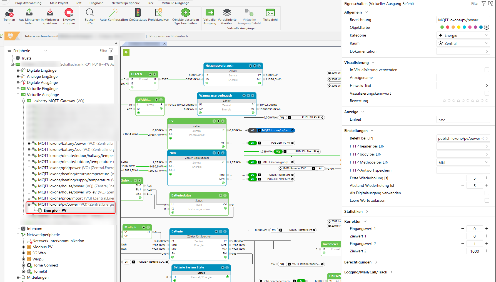
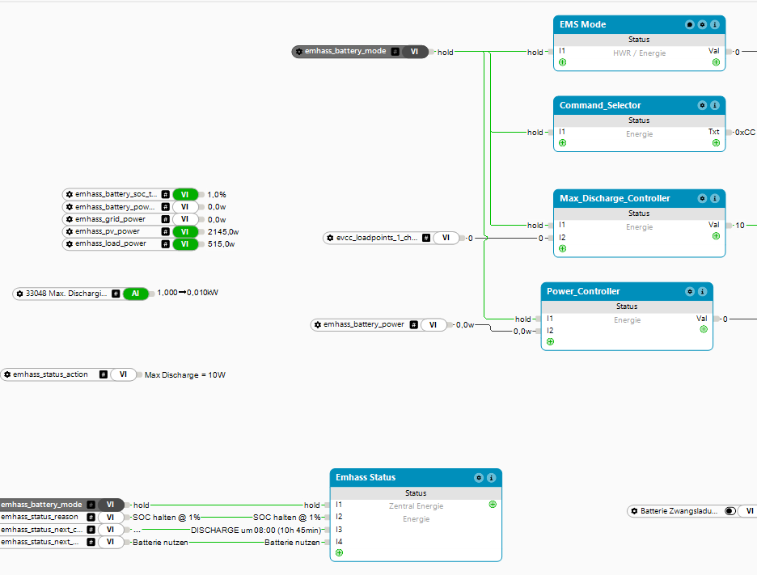
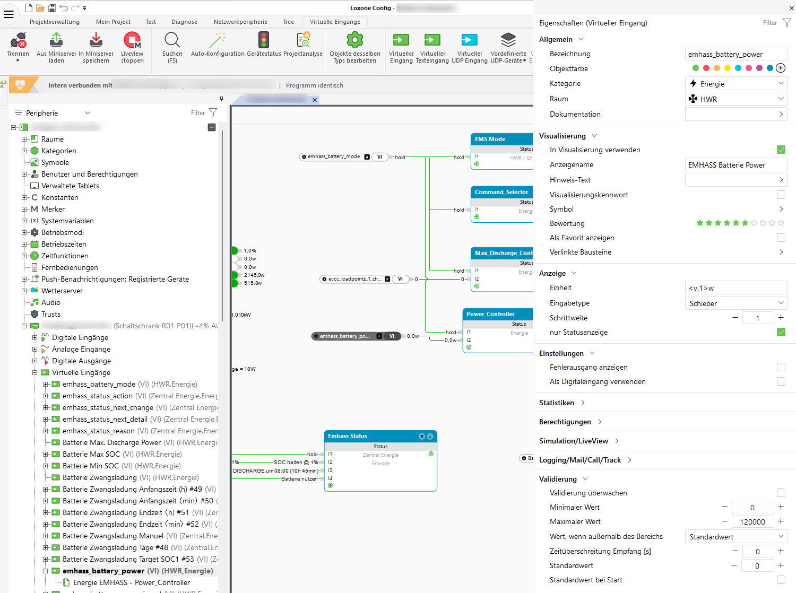
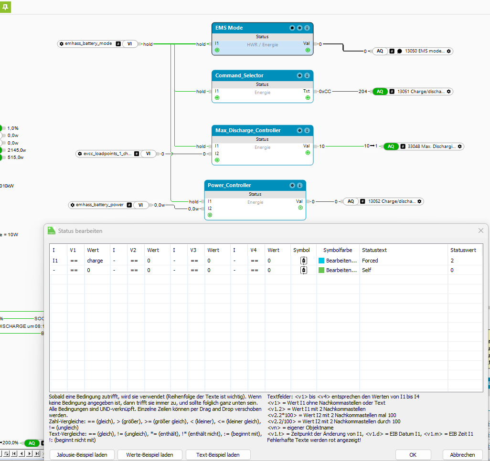
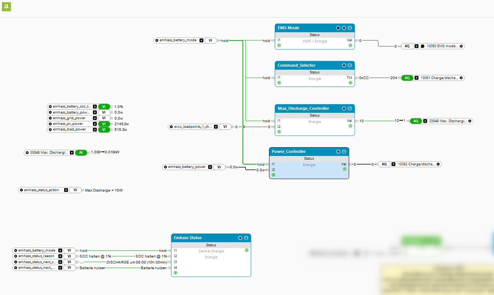

# Loxone MQTT Topics

## Overview

This documentation describes all MQTT topics for communication between Loxone and EMHASS.

---

## Virtual Outputs (Loxone → MQTT)

These values are sent by Loxone to the MQTT broker. They are received by Home Assistant and written to InfluxDB.

| Topic | Description | Unit | Source in Loxone |
|-------|-------------|------|------------------|
| `loxone/pv/power` | Current PV power | W | Modbus Register 5016 |
| `loxone/house/power` | Total house consumption | W | Calculation |
| `loxone/house/power_wo_ev` | House consumption without EV | W | Calculation |
| `loxone/grid/power` | Grid import (pos) / export (neg) | W | Modbus Register 13010 |
| `loxone/battery/soc` | Battery state of charge | % | Modbus Register 13022 |
| `loxone/battery/power` | Battery power | W | Modbus Register 13021 |
| `loxone/price/import` | Current electricity price | €/kWh | Tibber |

### Virtual Output Configuration

Example configuration for a Virtual Output Command:



```
Command: publish loxone/pv/power <v>
Scaling: 1:1000 (kW → W)
```

---

## Virtual Inputs (MQTT → Loxone)

These values are received by Loxone from the MQTT broker (sent by Node-RED).

### Control Topics

| Topic | Type | Values | Description |
|-------|------|--------|-------------|
| `emhass/battery/mode` | Text | charge, discharge, hold | Battery mode |
| `emhass/battery/power` | Analog | 0-5000 | Charge power in W |
| `emhass/battery/soc_target` | Analog | 0-100 | Target SOC in % |
| `emhass/battery/power_signed` | Analog | -5000 to +5000 | Original P_batt |

### Virtual Text Input for Mode



```
Name: emhass_battery_mode
Type: Virtual Text Input
MQTT Topic: emhass/battery/mode
```

### Virtual Analog Input for Power



```
Name: emhass_battery_power
Type: Virtual Input
MQTT Topic: emhass/battery/power
Analog: Yes
Max: 10000
```

### Status Topics (for visualization)

| Topic | Example | Description |
|-------|---------|-------------|
| `emhass/status/reason` | "EMHASS: Grid charge @ 12.5¢" | Current reason |
| `emhass/status/action` | "Forced Charge 3500W" | Current action |
| `emhass/status/next_change` | "HOLD at 18:00 (2h)" | Next change |
| `emhass/status/next_detail` | "Hold SOC @ 85%" | Change detail |

### Current EMHASS Values

| Topic | Type | Description |
|-------|------|-------------|
| `emhass/current/price_cents` | Analog | Current price in cents |
| `emhass/current/pv` | Analog | Planned PV power |
| `emhass/current/load` | Analog | Planned load |
| `emhass/current/soc` | Analog | Planned SOC |

---

## Status Blocks for Battery Control

Status blocks translate the EMHASS mode into Modbus registers.

### Battery Mode Status Block



```
Name: EMHASS Battery Mode
Inputs:
  - I1: emhass_battery_mode
  - I2: emhass_battery_power
States:
  - "charge": I1 == "charge"
  - "hold": I1 == "hold"  
  - "discharge": Default
```

### EMS_Mode_Controller (→ Register 13050)

| Input | Condition | Output | Meaning |
|-------|-----------|--------|---------|
| I1 | emhass_battery_mode == "charge" | 2 | Forced Mode |
| Default | - | 0 | Self-Consumption |

### Command_Controller (→ Register 13051)

| Input | Condition | Output | Meaning |
|-------|-----------|--------|---------|
| I1 | emhass_battery_mode == "charge" | 170 | 0xAA = Charge |
| Default | - | 204 | 0xCC = Stop |

### Max_Discharge_Controller (→ Register 33048)

| Input | Condition | Output | Meaning |
|-------|-----------|--------|---------|
| I1 | emhass_battery_mode == "hold" | 10 | ~100W max (Hold) |
| I2 | EVCC active | 10 | ~100W max |
| Default | - | 5000 | 5000W max |

**Important:** Value 10 in Loxone → 1 in Modbus → 100W (factor /100 in register)

### Power_Controller (→ Register 13052)

| Input | Condition | Output |
|-------|-----------|--------|
| I1 == "charge" | emhass_battery_power > 0 | emhass_battery_power |
| Default | - | 0 |

---

## Complete Program Page

Overview of the complete EMHASS energy program page in Loxone Config:



---

## Image Checklist

Please add the following screenshots to `docs/images/loxone/`:

- [ ] `virtual_input_mode.png` - Virtual Text Input configuration
- [ ] `virtual_input_power.png` - Virtual Analog Input configuration
- [ ] `virtual_output_pv.png` - Virtual Output Command configuration
- [ ] `status_block_battery.png` - Status block for battery mode
- [ ] `program_page_emhass.png` - Complete program page overview
