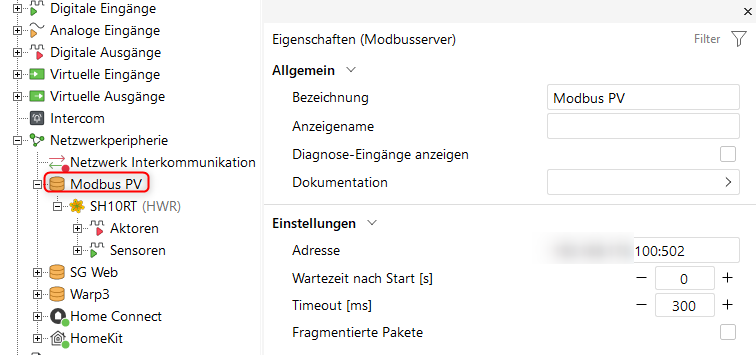
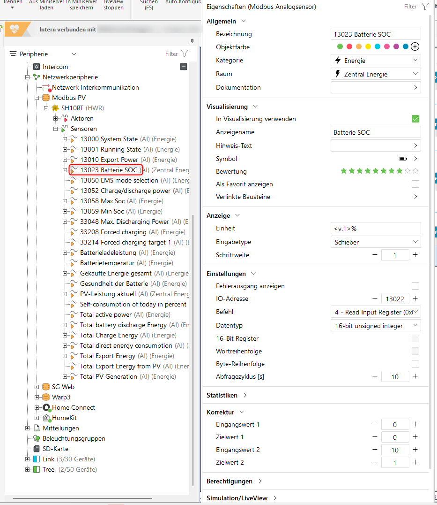
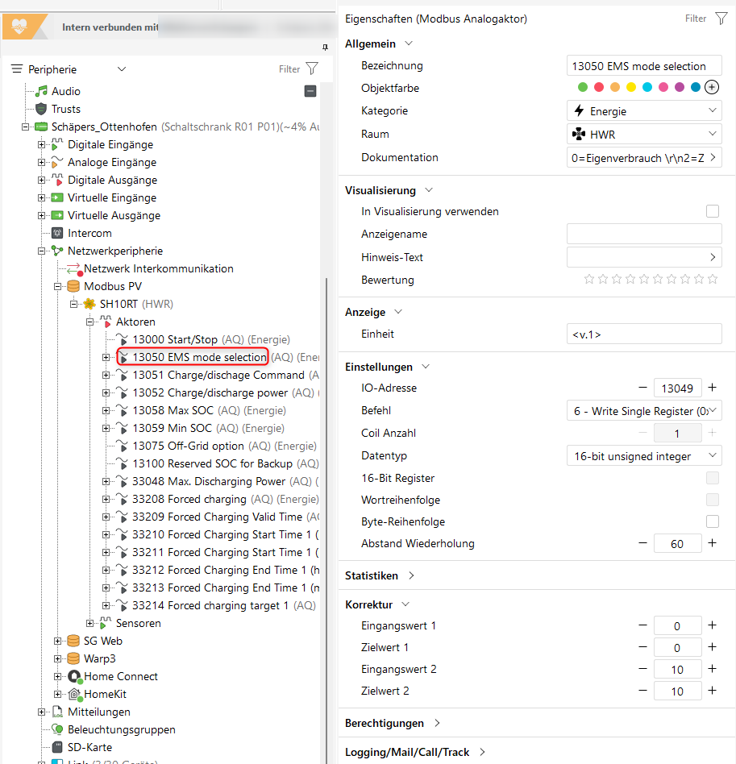

# Sungrow SHxxRT Modbus Registers

## Overview

This documentation describes the most important Modbus registers for Sungrow hybrid inverters of the SH-RT series (SH5RT, SH6RT, SH8RT, SH10RT).

**Note:** Register addresses in this documentation are 1-based (as in Sungrow manual). In Loxone Config, they must be reduced by 1 (0-based).

| Documentation | Loxone Config |
|---------------|---------------|
| 13050 | 13049 |
| 33048 | 33047 |

---

## Connection Parameters

| Parameter | Value |
|-----------|-------|
| Protocol | Modbus TCP |
| Port | 502 |
| Unit ID | 1 |
| Timeout | 300ms recommended |

### Modbus Server Configuration in Loxone



```
Name: Sungrow Inverter
Address: sungrow-ip:502
Timeout: 300ms
```

---

## Read Registers (Function Code 4 - Read Input Registers)

### Power Values

| Register | Name | Data Type | Factor | Unit | Description |
|----------|------|-----------|--------|------|-------------|
| 5016 | Total PV Power | U32 | /1000 | kW | Current PV power |
| 13010 | Export Power | S32 | /1000 | kW | Grid: positive=export, negative=import |
| 13021 | Battery Power | S16 | /1000 | kW | Battery: positive=discharge, negative=charge |

### Battery Status

| Register | Name | Data Type | Factor | Unit | Description |
|----------|------|-----------|--------|------|-------------|
| 13022 | Battery SOC | U16 | /10 | % | **Relative** state of charge |
| 13023 | Battery Health | U16 | /10 | % | State of Health |
| 13024 | Battery Temp | U16 | /10 | °C | Battery temperature |

### SOC Sensor Configuration Example



```
Type: Modbus Analog Sensor
Name: Battery SOC
Register: 13022 (in Loxone: 13021)
Function Code: 4 (Read Input)
Data Type: Unsigned 16-bit
Polling: 10s
Source High: 10
Dest High: 1
```

### Energy Counters

| Register | Name | Data Type | Factor | Unit |
|----------|------|-----------|--------|------|
| 13002 | Total PV Generation | U32 | /10 | kWh |
| 13036 | Total Import Energy | U32 | /100 | kWh |
| 13045 | Total Export Energy | U32 | /10 | kWh |
| 13026 | Total Battery Discharge | U32 | /10 | kWh |
| 13040 | Total Battery Charge | U32 | /10 | kWh |

### System Status

| Register | Name | Values |
|----------|------|--------|
| 13000 | System State | Various codes |
| 13001 | Running State | 0=Stop, 1=Run |

---

## Write Registers (Function Code 6 - Write Single Register)

### EMS Control

| Register | Name | Value Range | Description |
|----------|------|-------------|-------------|
| 13050 | EMS Mode | 0, 2, 3 | Operating mode |
| 13051 | Charge/Discharge Cmd | 0xAA, 0xBB, 0xCC | Charge/discharge command |
| 13052 | Charge/Discharge Power | 0-10000 | Power (factor /10) |

#### EMS Mode (13050)

| Value | Meaning | Description |
|-------|---------|-------------|
| 0 | Self-Consumption | Self-consumption optimization (default) |
| 2 | Forced Mode | Forced charge/discharge |
| 3 | External EMS | External control |

#### Charge/Discharge Command (13051)

| Value | Hex | Meaning |
|-------|-----|---------|
| 170 | 0xAA | Charge |
| 187 | 0xBB | Discharge |
| 204 | 0xCC | Stop |

### EMS Mode Actor Configuration Example



```
Type: Modbus Analog Actor
Name: EMS Mode
Register: 13050 (in Loxone: 13049)
Function Code: 6 (Write Single)
Source High: 10
Dest High: 10
```

### SOC Limits

| Register | Name | Value Range | Factor | Description |
|----------|------|-------------|--------|-------------|
| 13058 | Max SOC | 50-100 | /10 | Maximum state of charge |
| 13059 | Min SOC | 0-50 | /10 | Minimum state of charge |

**Important:** The SOC in register 13022 is **relative** between Min and Max SOC!

### Discharge Limit

| Register | Name | Value Range | Factor | Description |
|----------|------|-------------|--------|-------------|
| 33048 | Max Discharge Power | 0-5000 | /100 | Maximum discharge power |

**Example:** Loxone sends 10 → Modbus receives 1 → 100W max discharge

### Forced Charging

| Register | Name | Description |
|----------|------|-------------|
| 33208 | Forced Charging Enable | 0xAA=On, 0xCC=Off |
| 33209 | Valid Time | 0=Weekday, 1=Weekend, 2=Daily |
| 33210 | Start Hour 1 | 0-23 |
| 33211 | Start Minute 1 | 0-59 |
| 33212 | End Hour 1 | 0-23 |
| 33213 | End Minute 1 | 0-59 |
| 33214 | Target SOC 1 | 0-100% |

---

## Scaling in Loxone

### Modbus Analog Sensor (Read)

| Register | Source High | Dest High | Result |
|----------|-------------|-----------|--------|
| 13022 (SOC) | 10 | 1 | % direct |
| 13021 (Batt Power) | 1000 | 1 | W direct |
| 13010 (Grid Power) | 1000 | -1 | W (sign inverted) |

### Modbus Analog Actor (Write)

| Register | Source High | Dest High | Example |
|----------|-------------|-----------|---------|
| 13050 (EMS Mode) | 10 | 10 | 2 → 2 |
| 13051 (Command) | 10 | 10 | 170 → 170 |
| 13052 (Power) | 10 | 10 | 3500 → 350 |
| 33048 (Max Disch) | 10 | 1 | 10 → 1 (=100W) |

---

## Battery Mode Summary

| Desired Mode | EMS (13050) | Cmd (13051) | Max Disch (33048) | Power (13052) |
|--------------|-------------|-------------|-------------------|---------------|
| **discharge** | 0 | 204 | 5000 | 0 |
| **hold** | 0 | 204 | 10 | 0 |
| **charge** | 2 | 170 | 5000 | Charge power |

---

## Notes

1. **Relative SOC:** Sungrow always shows SOC between Min and Max SOC. With Min=20%, Max=90%, SOC=50% means an actual charge level of ~55%.

2. **Register offset:** Loxone uses 0-based addresses. Register 13050 in manual = 13049 in Loxone.

3. **Factor 33048:** This register has factor 100. Value 50 = 5000W. In Loxone, use scaling 10:1.

4. **Self-Consumption:** In mode 0, Sungrow controls automatically. PV surplus is charged, load is supplied from battery.

5. **Forced Mode:** Only needed for grid charging. For normal discharge, Self-Consumption is sufficient.

---

## Image Checklist

Please add the following screenshots to `docs/images/loxone/`:

- [ ] `modbus_server.png` - Modbus Server configuration
- [ ] `modbus_sensor_soc.png` - Modbus Analog Sensor for SOC
- [ ] `modbus_actor_ems.png` - Modbus Analog Actor for EMS Mode
